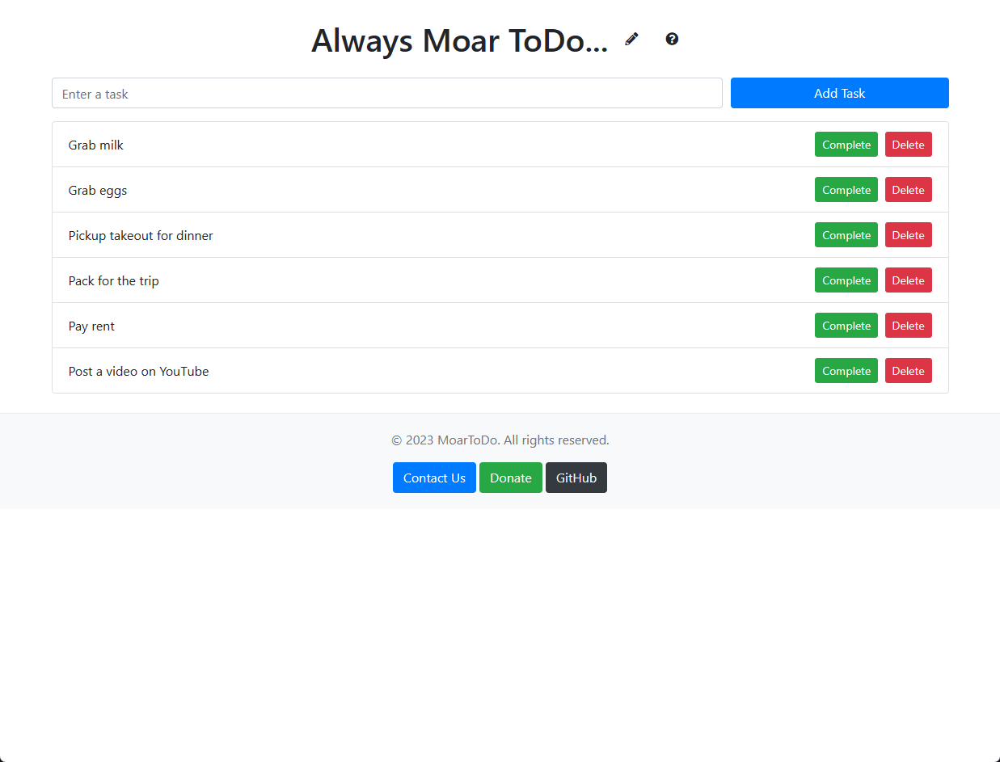

# MoarToDo

MoarToDo is a free and simple ToDo list web application that allows you to manage your tasks easily. It is designed to be intuitive and user-friendly, making task management a breeze.

Live version can be accessed at [moartodo.com](https://www.moartodo.com/)



## Features

- Easy to use interface for managing tasks
- Tasks are stored in the browser's local storage, not on our servers
- Sortable task list
- Editable title

## Getting Started

To get a local copy up and running, follow these steps:

1. Clone the repository:

```bash
git clone https://github.com/yourusername/MoarToDo.git
```

2. Open the `index.html` file in your browser.

## Contributing

We welcome contributions from the community! If you have an idea for a feature, submit an issue describing your idea. Also, feel free to fork this repository and submit pull requests.

1. Fork the project
2. Create your feature branch (`git checkout -b feature/YourFeature`)
3. Commit your changes (`git commit -m 'Add some YourFeature'`)
4. Push to the branch (`git push origin feature/YourFeature`)
5. Open a pull request

Please make sure to update tests as appropriate.

## Acknowledgements

This project is inspired by the [ToDoList](https://github.com/DecoyGPT/todolist) repository, which was showcased in a [YouTube tutorial](https://www.youtube.com/watch?v=9hthxE2gCIo) about developing web applications with the assistance of ChatGPT.

## License

This project is licensed under the terms of the MIT license.
